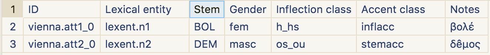
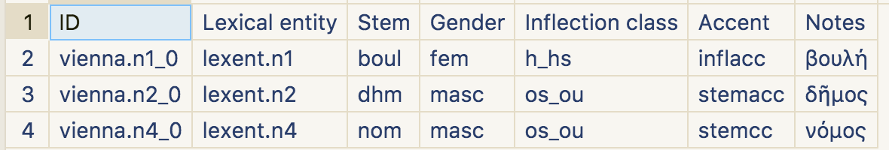
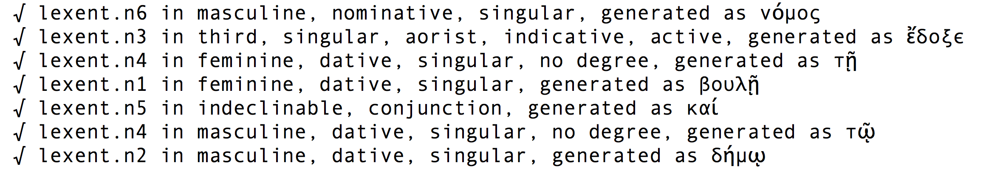

# ... in multiple dialects and alphabets

---

# Digital scholarship and Classics

-   25 years ago: a leading discipline
-   today: largely absent from most innovative areas of textual analysis?

---

# Latent pattern recognition

-    topic modelling
-    embedded laten patte

---

# Good and bad reasons

-   corpus size
-   tolerance for imprecise editions
-   morphological complexity

---

# Limitations of current standards

-   ISO 639* family: Greek dialects not recognized
-   Unicode:
    -   language and script conflated
    -   epichoric scripts not recognized
    -   confusion of multivalent and contradictory glyphs

---

---

# Motivation and background

HMT:

-   dialects
-   vocabulary

---

historical language: corpus-linguistic perspective

for a given corpus:

-    unique lexicon
-    unique set of inflectional rules

---

# "Greek" defined by *shared categories*

- "noun" (GCN)
- "adjective" (GCND)
- "conjugated verb" (PNTMV)
- "infinitive" (TV)
- "participle" (GCTMV)
- "verval adjective" (GCN)
- "adverb" (Degree)
- "indeclinable" (part of speech)

---

"Analysis by synthesis" algorithm

---

FSA not expressive enough for Greek morphology

crossing of lexical and inflectional properties of Greek accent cannot be reduced to context-free state transitions

---

# A simple worked example

---

Andocides *On the Mysteries* 1.96

> Νόμος. ἔδοξε τῇ βουλῇ καὶ τῷ δήμῳ.

---

IG 1.3, 156

---

# Vocabulary ("stems")

---

# Inflectional rules

---

# Analysis

---

# Analysis

---

# Generated

---

# Pipeline

Output of Attic analysis fed as input to literary generator:

---

# References

-   "Morphological Analysis of Historical Languages," *BICS* 59-2 (2016) 89-102.
-   https://github.com/neelsmith/kanones.git
