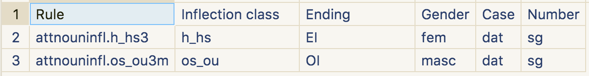
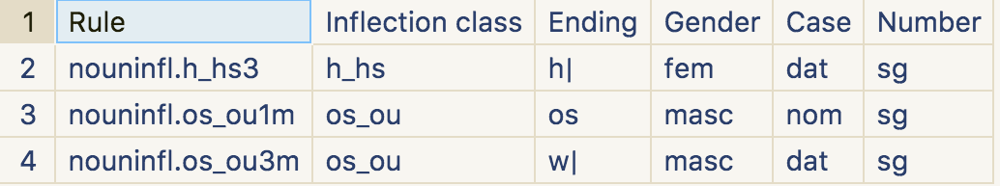
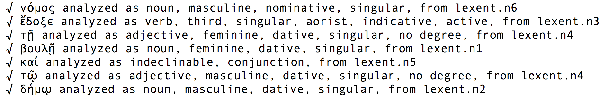
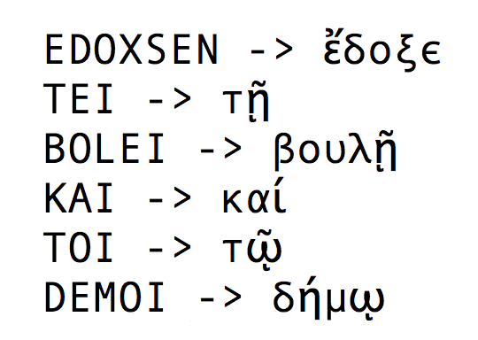

# ... in multiple dialects and alphabets

---

# Digital scholarship and Classics

-   25 years ago: a leading discipline
-   today: largely absent from new areas of textual analysis?

---

# Example: latent pattern recognition

-    topic modelling
-    semantic relations with embedded word vectors

---

# Some reasons, good and bad

-   corpus size vs. tolerance for imprecise editions
-   **morphological complexity**

---

# Motivation

Homer Multitext project: manuscripts with

-   multiple dialects
-   unattested vocabulary
-   distinct orthographies

---

# Limitations of current standards

-   ISO 639* family: Greek dialects not recognized
-   Unicode:
    -   language and script conflated
    -   epichoric scripts not recognized
    -   confusion of multivalent and contradictory glyphs

---

# In 2017, it is (still!) not possible to encode Greek

---

---

# A corpus-linguistic perspective

Every corpus is characterized by:

-    a unique lexicon
-    a unique set of inflectional rules

---

# "Greek" is defined by *analytical categories*

- "noun" (GCN)
- "adjective" (GCND)
- "conjugated verb" (PNTMV)
- "infinitive" (TV)
- "participle" (GCTMV)
- "verbal adjective" (GCN)
- "adverb" (Degree)
- "indeclinable" (part of speech)

---

"Analysis by synthesis" algorithm

---

FSA not expressive enough for Greek morphology

crossing of lexical and inflectional properties of Greek accent cannot be reduced to context-free state transitions

---

# A simple worked example

---

Andocides *On the Mysteries* 1.96

> Νόμος. ἔδοξε τῇ βουλῇ καὶ τῷ δήμῳ.

---

IG 1.3, 156

---

# Vocabulary ("stems")

---

# Inflectional rules

---

# Analysis

---

# Analysis

---

# Generated

---

# Pipeline

Output of Attic analysis fed as input to literary generator:

---

# Possibilities

---

# Current state

---

# Thank you!

For more information:

-   "Morphological Analysis of Historical Languages," *BICS* 59-2 (2016) 89-102.
-   <https://github.com/neelsmith/kanones.git>
