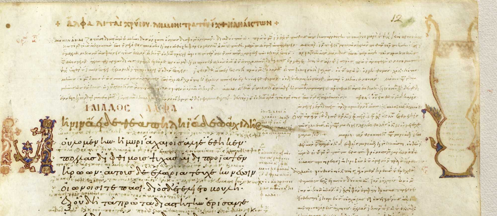
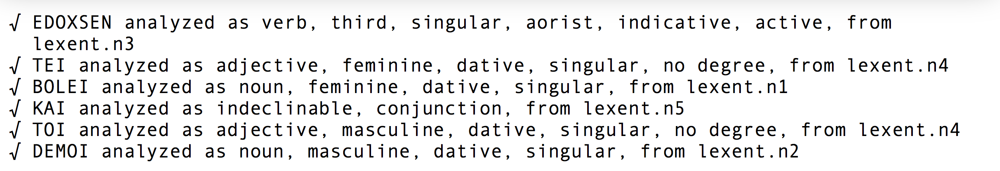

# ... in multiple dialects and alphabets

---

# Digital scholarship and Classics

-   25 years ago: a leading discipline
-   today: largely absent from new areas of textual analysis?

---

# Example: latent pattern recognition

-    topic modelling
-    semantic relations with embedded word vectors

---

# Some reasons, good and bad

-   corpus size vs. tolerance for imprecise editions
-   **morphological complexity**

---

# Motivation

Homer Multitext project: manuscripts with

-   multiple dialects
-   unattested vocabulary
-   distinct orthographies

---

# Current standards

-   ISO 639* family: Greek dialects not recognized
-   Unicode:
    -   language and script conflated
    -   epichoric scripts not recognized
    -   confusion of multivalent and contradictory glyphs

---

> In 2017, it is (still!) not possible to encode Greek

---

---

# Secession, 1

Encode Greek in a *specified orthography*, including :

-   encoding in (primarily) ASCII characters with distinct character for accent, breathing
-   encoding in (primarily) Greek Unicode suitable for display

---

# Encoding Greek

Literary Greek:

`ἔδοξε == e)/doce`

Pure diplomatic rendering of classical Attic:

`εδοχσεν == EDOXSEN`

---

# Secession, 2

For historical languages, every analysis is corpus-specific

---

# A corpus-linguistic perspective

Every corpus is characterized by:

-    a unique lexicon in a specified orthography
-    a unique set of inflectional rules in a specified orthography

---

# So not *a parser*, but...

>a system for building corpus-specific parsers

---

# Citable results

-   each lexicon entry has a unique ID for *lexical entity*
-   each inflectional has a unique ID

---

# "Greek" is defined by *analytical categories*

- "noun" (GCN)
- "adjective" (GCND)
- "conjugated verb" (PNTMV)
- "infinitive" (TV)
- "participle" (GCTMV)
- "verbal adjective" (GCN)
- "adverb" (Degree)
- "indeclinable" (part of speech)

---

# An analysis is composed of

-   a string of characters analyzed
-   a form
-   a uniquely identified lexical entity
-   a uniquely identified inflectional rule

---

# Kanónes

A system for building parsers from tables defining:

1.  inflectional rules
2.  a lexicon of "stems"

---

# Parsing morphology

-   standard technology: **finite state transducers** (FST)
-   require context-free state transitions

---

# Parsing Greek

FSTs fail!

>Crossing of lexical and inflectional properties of accent cannot be reduced to context-free state transitions

---

# Solution in Kanónes

"Analysis by synthesis" algorithm:

1. collect an accented word
2. strip its accents, and use FST to get *possible* analyses
3. algorithmically apply correct accent
4. compare accented candidate forms to original word

---

# Example parse

1. original word: **εἶπε**
2. εἰπε analyzed as:
    - 3rd singular aorist indicative active
    - 2nd singular aorist imperative active
3. accenting yields:
    - εἶπε for 3rd singular aorist indicative active
    - εἰπέ for 2nd singular aorist imperative active
4. so solution is **3rd singular aorist indicative active**

---

# A simple worked example: two parallel corpora

---

Andocides *On the Mysteries* 1.96

> Νόμος. ἔδοξε τῇ βουλῇ καὶ τῷ δήμῳ.

---

IG 1.3, 156

---

# Vocabulary ("stems")

---

# Inflectional rules

---

# Analysis

---

# Analysis

---

# Generated

---

# Pipeline

Output of Attic analysis fed as input to literary generator:

---

# Current state

-   largely completed in 2016 using Stuttgart FST toolkit + Java/Groovy custom classes
-   summer 2017:  porting custom classes to Scala substantially complete
-   initial test corpora from HMT project:
    - complete *Iliad* manuscripts
    - more than 10,000 scholia

---

# Possibilities

-   morphologically sensitive structured searching
-   lexically unified corpus for latent pattern analysis
-   integration of corpora in distinct writing systems or dialects

---

# Thank you!

For more information:

-   "Morphological Analysis of Historical Languages," *BICS* 59-2 (2016) 89-102.
-   <https://github.com/neelsmith/kanones>
